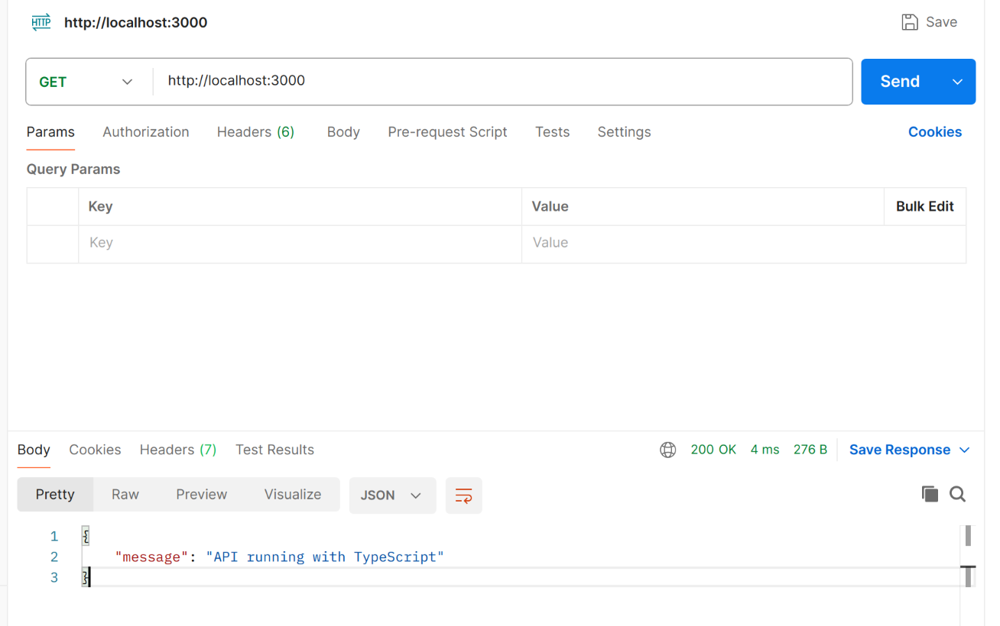
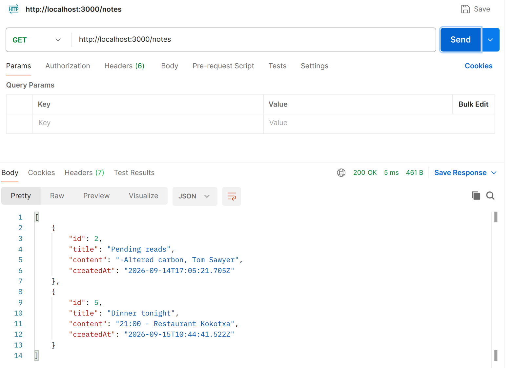
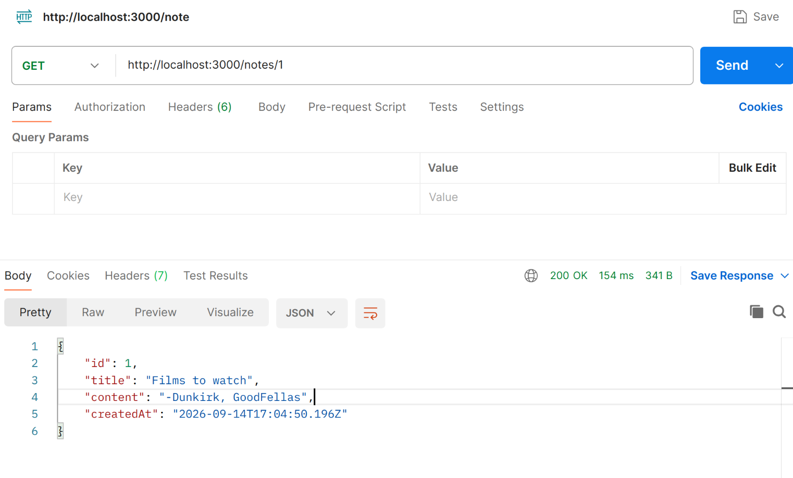
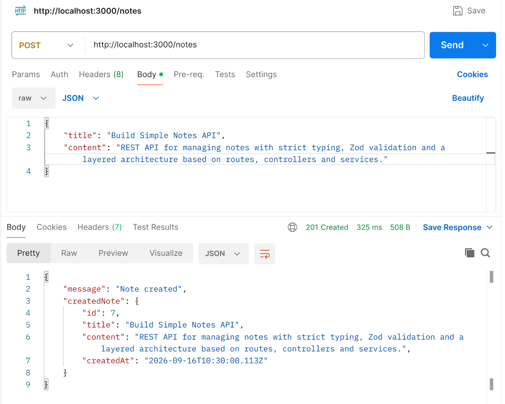
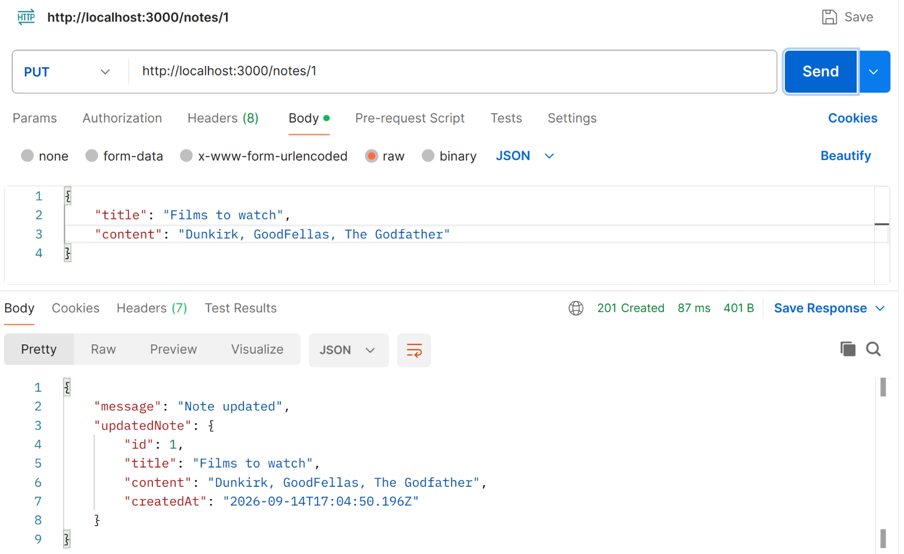
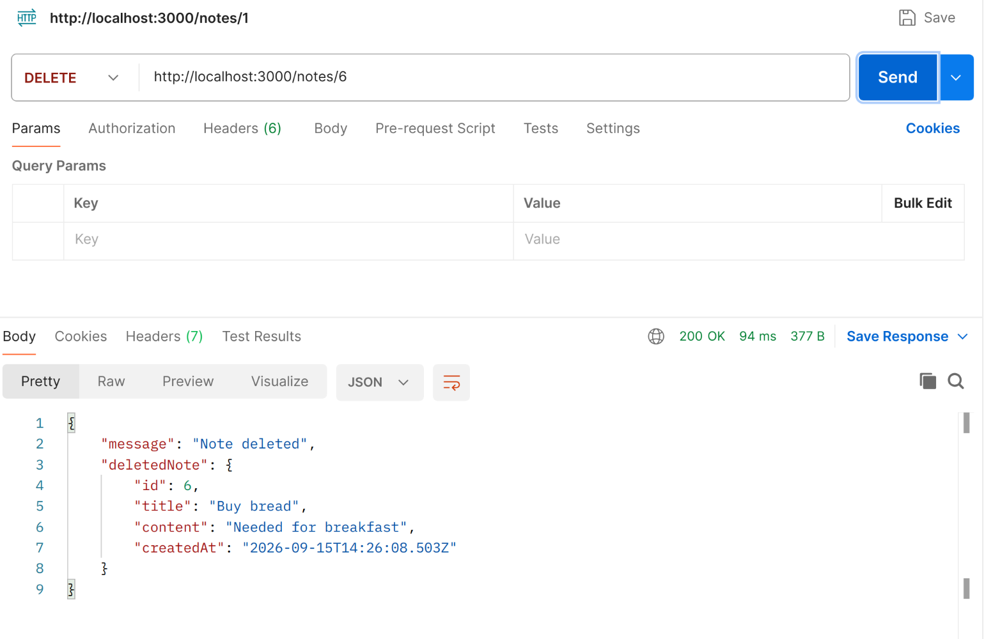
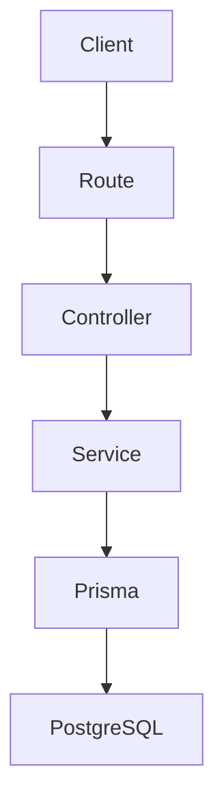

# Simple Notes API

REST API for managing notes built with Node.js, Express, TypeScript, Prisma and PostgreSQL.

The project applies strict typing, data validation with Zod, centralized error handling, integration testing and a layered architecture based on routes, controllers and services to improve maintainability and reduce runtime errors.

## Postman Screenshots

| <br> Server health check | <br>Get all notes | <br>Get single note |
| ----------------------------------------------------------------------- | --------------------------------------------------------------- | ---------------------------------------------------------------- |

| <br>Create a note | <br>Update a specific note | <br>Delete a note |
| --------------------------------------------------------------- | ----------------------------------------------------------------------- | ----------------------------------------------------------------- |

## Architecture



## Use cases

### Create a note

Users can create a new note by submitting its title and content.
The note is validated before being stored in the database.

### Get all notes

Users can retrieve all notes from the database.

### Get a note by id

Users can retrieve a specific note from the database using its id.

### Update a note

Users can update a note title and content.
The note is validated before being stored in the database.

### Delete a note

Users can delete a specific note from the database.

## Stack

- Node.js
- TypeScript
- Express
- Prisma
- PostgreSQL
- Zod
- Vitest
- Supertest
- Centralized error handling

## How to run

1. Clone the repo from GitHub.

```
git clone git@github.com:pedromorenovillar/simple-notes-api.git
```

2. Install project dependencies.

```
npm install
```

3. Create .env file and fill in environment variables

```
cp .env.example .env          # Fill in environment variables
```

4. Migrate database

```
npx prisma migrate dev
```

5. Start server

```
npm run dev
```

## Concepts Practiced

- Building a type-safe REST API with TypeScript.
- Integration with Prisma and how the schema models can be inferred as types.
- Separation of concerns between routes, controllers, services and Prisma.
- Typed controllers to reduce errors.
- TypeScript type narrowing along the program flow.
- Custom error classes using inheritance.
- Centralized error handling middleware.

## API examples

- GET /health

Returns the health status of the API.

- GET /notes

Returns all notes stored in the database.

- GET /notes/:id

Returns a specific note from the database.

- POST /notes

Adds a note to the database.

- PUT /notes/:id

Updates a specific note from the database.

- DELETE /notes/:id

Deletes a specific note from the database.

## Project structure

```bash
simple_notes_api/
├── generated
│   └── prisma
├── package.json
├── package-lock.json
├── prisma
│   ├── migrations
│   └── schema.prisma
├── prisma7.config.js
├── prisma7.config.ts
├── README.md
├── skills-lock.json
├── src
│   ├── controllers
│   ├── lib
│   ├── routes
│   ├── schemas
│   ├── server.ts
│   ├── services
│   └── types
└── tsconfig.json
```
